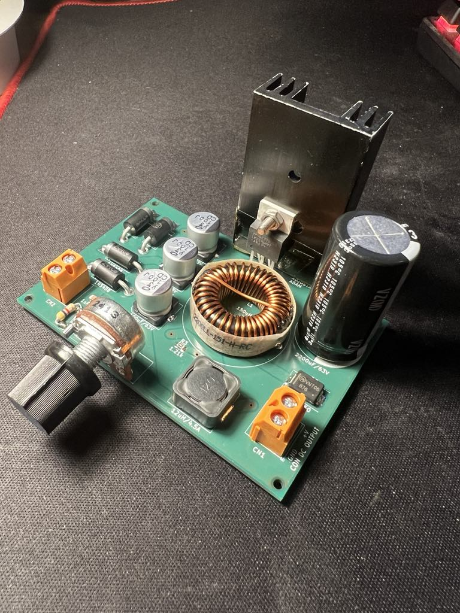
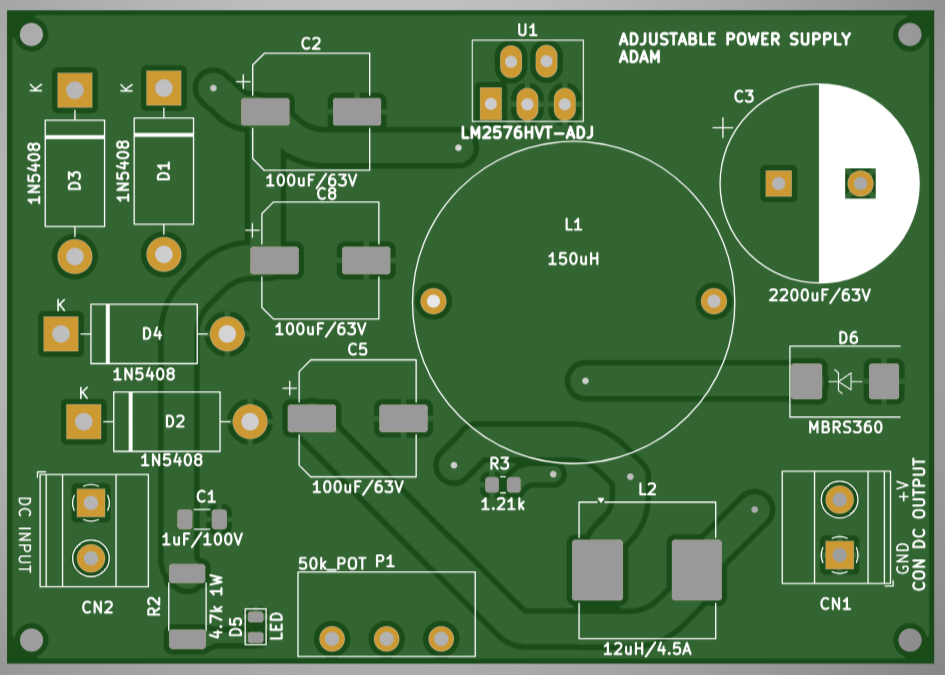

# Adjustable Power Supply (1.23V–50V, 3A)

This repository contains the complete design of an adjustable DC power supply based on the **LM2576HVT-ADJ** buck regulator.

The power supply converts an input voltage of up to **55V DC** into an adjustable output voltage ranging from **1.23V to 50V**, with a maximum output current of **3A**.  
The design was simulated, built, tested, and verified on real hardware.

---

## Features

- Buck converter based on **LM2576HVT-ADJ**
- Adjustable output voltage: **1.23V – 50V**
- Maximum output current: **3A**
- Input voltage up to **55V DC**
- Fixed switching frequency: **52 kHz**
- LC output ripple filter
- Internal over-current and thermal protection
- Screw terminals for input and output
- On-board power LED
- Designed in **KiCad**

---

## Assembled PCB

Photo of the assembled and tested PCB:

---

## PCB Layout

PCB layout overview:

---

## EMC Measurements

Radiated EMC measurements were performed in an EMC chamber for evaluation and learning purposes.

- Measurement distance: **3 m**
- Frequency range: **30 MHz – 1 GHz**
- Detector: Peak (QPK)
- Polarization: Horizontal and Vertical

All EMC measurement results and screenshots are available in the folder:

> No EMC class (Class A / Class B) is claimed.  
> Measurements were exploratory and not certification tests.

---

## Repository Contents

- `Report and project plan/` – Full project report and documentation (PDF)
- `Results Of EMC/` – EMC measurement results
- `Project_Gerber&drill.zip` – Manufacturing-ready Gerber and drill files
- `PCB.png` – Assembled PCB photo
- `PCB_layout.png` – PCB layout image
- `README.md` – Project overview
- `LICENSE` – License information

---

## Performance Summary

- Stable voltage regulation across the full load range
- Load tested up to **3A**
- Low output ripple due to LC filtering
- Components operate within safe thermal limits
- Improved PCB revision verified and works as expected

---

## Tools Used

- **KiCad** – schematic capture and PCB layout
- **MATLAB** – converter simulation
- **Oscilloscope & thermal camera** – measurements
- **EMC chamber** – radiated emissions testing

---

## Notes and Limitations

- Prototype / educational project
- Not safety-certified or EMC-certified
- Slight delay when reducing output voltage with no load
- Intended for lab and learning use

---

## Author

**Adam Alshami**  
Electrical Engineering Student  
June 2025

---

## License

See the `LICENSE` file for details.  
No warranty. Use at your own risk.

